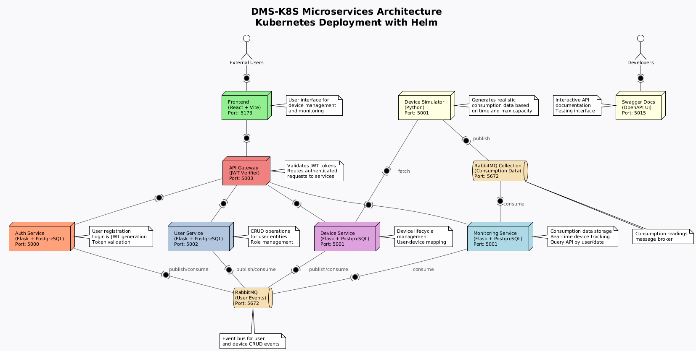

# Device Management System — Kubernetes-Based Distributed Platform

## Minikube Setup

Follow these steps to set up and run the project on **Minikube**.

### Prerequisites

- Install [Minikube](https://minikube.sigs.k8s.io/docs/start/)
- Install [Helm](https://helm.sh/docs/intro/install/)
- Install [kubectl](https://kubernetes.io/docs/tasks/tools/)
- Ensure Docker is installed and running

---

### Steps

1. **Start Minikube**

   - **Linux**
     ```bash
     minikube start
     ```

   - **Windows (using Hyper-V driver)**
     ```bash
     minikube start --driver=hyperv
     ```

2. **Enable Ingress Controller**
   ```bash
   minikube addons enable ingress
   ```

3. **Deploy the Helm Chart**
   ```bash
   helm install proiect ./ds-proiect
   ```

4. **Verify the Deployment**
   ```bash
   kubectl get all
   ```

5. **Access the Application**
   - Retrieve the Minikube IP:
     ```bash
     minikube ip
     ```
   - Then open the following URLs:
     - **Frontend:** `http://<minikube-ip>:30000`
     - **Swagger UI:** `http://<minikube-ip>:30001`

---

## Project Overview

The **Device Management System (DMS)** is a distributed, microservices-based platform that allows authenticated users to monitor and manage energy metering devices with **real-time consumption tracking**.

This implementation provides a **Kubernetes-native solution**, leveraging Helm, declarative manifests, and service orchestration for scalability and modularity.

The system combines **Request-Reply** and **Event-Driven** communication patterns:
- **Synchronous**: RESTful APIs for user/device management
- **Asynchronous**: RabbitMQ-based event streaming for real-time consumption data

---

## Microservices Architecture

| Service | Description |
|----------|-------------|
| **Authentication Service** | Handles user registration, login, JWT generation, and validation |
| **User Management Service** | Provides CRUD operations for user entities and role assignments |
| **Device Management Service** | Manages device lifecycle and maps devices to users |
| **Monitoring Service** | Real-time consumption data collection, storage, and querying |
| **Device Simulator** | Generates realistic consumption data based on device capacity and time patterns |
| **Frontend (React)** | Offers a browser-based, role-aware interface for Admins and Clients |
| **Swagger UI** | Interactive API documentation and testing interface |

---

## API Gateway & Reverse Proxy

The system uses an **NGINX Ingress Controller** as both a **reverse proxy** and **API gateway**.  
Key responsibilities include:
- JWT token validation via the **JWT Verifier Service** (`auth-url` annotation)
- Path-based routing (`/users`, `/devices`, `/consumptions`, `/login`, etc.)
- Role-based access filtering and request forwarding

---


## Kubernetes Architecture

All services are deployed as independent **Kubernetes Deployments** with **ClusterIP Services** for internal communication.  
Core features include:
- Declarative manifests for each component  
- Namespaced isolation and configuration management through ConfigMaps and Secrets  
- Persistent storage for PostgreSQL databases via PVCs  
- Central ingress entrypoint with NGINX routing rules  

### Deployment Diagram



### Simplified Deployment Diagram

```
+---------------------------------------------------------------------------------+
|                             Kubernetes Cluster                                  |
|                                                                                 |
|  +------------------+       +----------------------------+       +------------+  |
|  | Frontend (React) | <----> | NGINX Ingress Controller  | <----> | Swagger UI |  |
|  +------------------+       +-------------+--------------+       +------------+  |
|                                    |                                           |
|        +---------------------------+-------------------+                        |
|        |                           |                   |                        |
|   +----v----+                +-----v------+       +-----v-----+                 |
|   | AuthSvc |                | UserSvc    |       | DeviceSvc |                 |
|   +----+----+                +-----+------+       +-----+-----+                 |
|        |                           |                    |                       |
|  +-----v----+               +------v-----+        +------v----+                 |
|  | Auth DB  |               | User DB    |        | Device DB |                 |
|  +----------+               +------------+        +-----------+                 |
|                                                                                 |
|  +------------------+       +------------------+       +------------------+     |
|  | Device Simulator | ----> | RabbitMQ (Events)| ----> | Monitoring Service|     |
|  +------------------+       +------------------+       +-----+------------+     |
|                                                     |                   |       |
|                                                     |             +-----v-----+ |
|                                                     |             | Monitor DB| |
|                                                     |             +-----------+ |
|                                                     |                         |
|                                                     +-------------------------+
|                                                               |
|                                                       +-------v-------+
|                                                       | RabbitMQ (Data)|
|                                                       +---------------+
```

**Legend:**
- **Frontend**: React-based user interface
- **API Gateway**: NGINX Ingress with JWT validation
- **Auth/User/Device Services**: Flask microservices with PostgreSQL
- **Monitoring Service**: Consumption data storage and API
- **Device Simulator**: Generates realistic consumption data
- **RabbitMQ**: Message brokers for event-driven communication
- **Swagger UI**: API documentation and testing interface

---

## Technologies Used

- **Kubernetes** for orchestration  
- **Helm** for deployment templating  
- **Docker** for containerization  
- **PostgreSQL** for data persistence  
- **React** for frontend  
- **Flask** for backend microservices  
- **NGINX Ingress Controller** for routing and API gateway  
- **JWT** for authentication and authorization  
